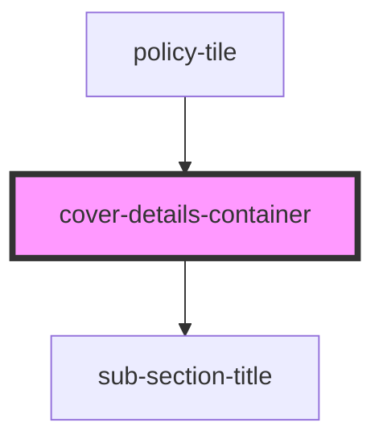

# cover-details-container

<!-- Auto Generated Below -->

## Properties

| Property       | Attribute      | Description | Type                                | Default     |
| -------------- | -------------- | ----------- | ----------------------------------- | ----------- |
| `coverdetails` | `coverdetails` |             | `CoverDetailsInterface[] \| string` | `undefined` |

## Dependencies

### Used by

 - [policy-tile](../policy-tile)

### Depends on

- [sub-section-title](../sub-section-title)

### Graph

----------------------------------------------

*ACME documents Inc!*
