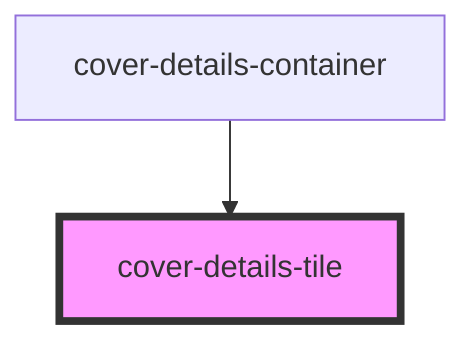

# cover-details-tile

<!-- Auto Generated Below -->

## Properties

| Property       | Attribute      | Description | Type                                | Default     |
| -------------- | -------------- | ----------- | ----------------------------------- | ----------- |
| `coverdetails` | `coverdetails` |             | `CoverDetailsInterface[] \| string` | `undefined` |
| `coverindex`   | `coverindex`   |             | `number`                            | `undefined` |

## Dependencies

### Used by

 - [cover-details-container](../../page-layout/cover-details-container)

### Graph

----------------------------------------------

*ACME documents Inc!*
