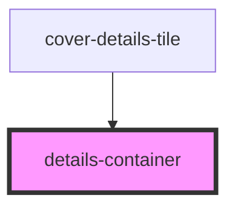

# details-container

<!-- Auto Generated Below -->

## Properties

| Property       | Attribute      | Description | Type                            | Default     |
| -------------- | -------------- | ----------- | ------------------------------- | ----------- |
| `coverdetails` | `coverdetails` |             | `PolicyDataInterface \| string` | `undefined` |
| `detailstype`  | `detailstype`  |             | `string`                        | `undefined` |

## Dependencies

### Used by

 - [cover-details-tile](../cover-details-tile)

### Graph

----------------------------------------------

*ACME documents Inc!*
