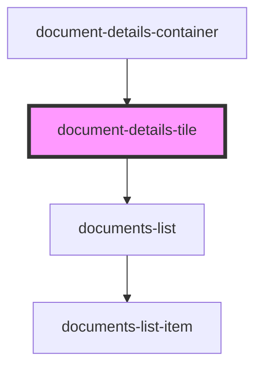

# document-details-tile

<!-- Auto Generated Below -->

## Properties

| Property       | Attribute      | Description | Type                            | Default     |
| -------------- | -------------- | ----------- | ------------------------------- | ----------- |
| `coverdetails` | `coverdetails` |             | `PolicyDataInterface \| string` | `undefined` |
| `coverindex`   | `coverindex`   |             | `number`                        | `undefined` |

## Dependencies

### Used by

 - [document-details-container](../../page-layout/document-details-container)

### Depends on

- [documents-list](../documents-list)

### Graph

----------------------------------------------

*ACME documents Inc!*
