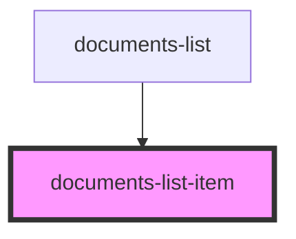

# documents-list-item

<!-- Auto Generated Below -->

## Properties

| Property        | Attribute        | Description                                                         | Type                              | Default     |
| --------------- | ---------------- | ------------------------------------------------------------------- | --------------------------------- | ----------- |
| `document`      | `document`       | Prop: document: object Document Details                             | `DocumentDataInterface \| string` | `undefined` |
| `documentIndex` | `document-index` | Prop: documentIndex: number The document index in the document list | `number`                          | `undefined` |

## Events

| Event              | Description                                                           | Type               |
| ------------------ | --------------------------------------------------------------------- | ------------------ |
| `downloadDocument` | Event: downloadDocument: EventEmitter Event to fire if data validates | `CustomEvent<any>` |

## Dependencies

### Used by

 - [documents-list](../documents-list)

### Graph

----------------------------------------------

*ACME documents Inc!*
