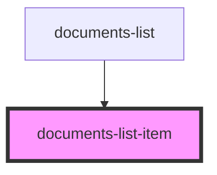

# documents-list-item

<!-- Auto Generated Below -->

## Properties

| Property        | Attribute       | Description | Type                              | Default     |
| --------------- | --------------- | ----------- | --------------------------------- | ----------- |
| `document`      | `document`      |             | `DocumentDataInterface \| string` | `undefined` |
| `documentindex` | `documentindex` |             | `number`                          | `undefined` |

## Dependencies

### Used by

 - [documents-list](../documents-list)

### Graph

----------------------------------------------

*ACME documents Inc!*
