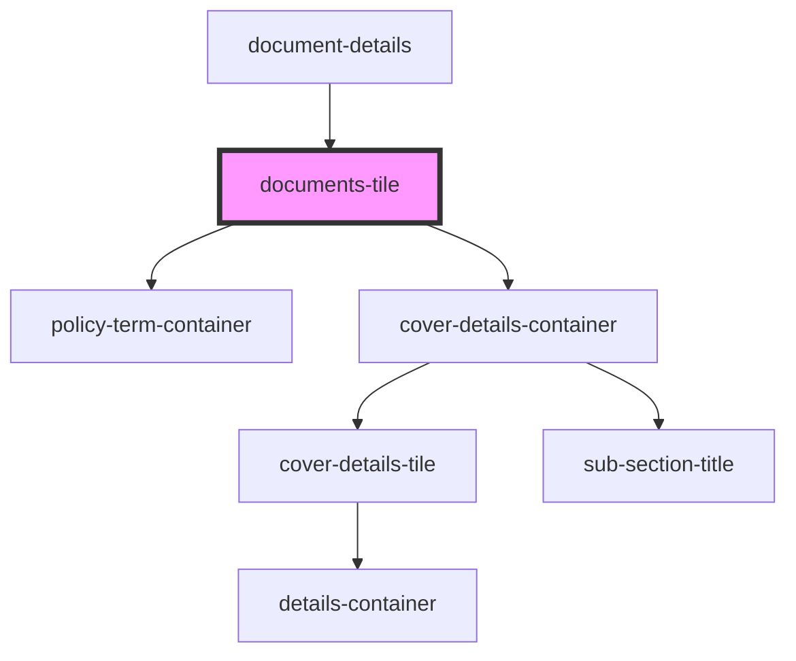

# documents-tile

<!-- Auto Generated Below -->

## Properties

| Property        | Attribute     | Description | Type                  | Default     |
| --------------- | ------------- | ----------- | --------------------- | ----------- |
| `policydetails` | --            |             | `PolicyDataInterface` | `undefined` |
| `policyindex`   | `policyindex` |             | `number`              | `undefined` |

## Dependencies

### Used by

 - [document-details](../../page-layout/document-details)

### Depends on

- [policy-term-container](../../page-layout/policy-term-container)
- [cover-details-container](../../page-layout/cover-details-container)

### Graph

----------------------------------------------

*ACME documents Inc!*
