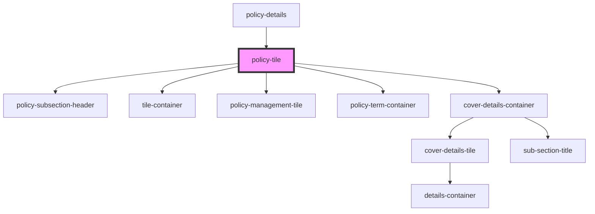

# policy-tile

<!-- Auto Generated Below -->

## Properties

| Property        | Attribute     | Description                                                      | Type                  | Default     |
| --------------- | ------------- | ---------------------------------------------------------------- | --------------------- | ----------- |
| `policydetails` | --            | Prop: policydetails: PolicyDataInterface Policy Data             | `PolicyDataInterface` | `undefined` |
| `policyindex`   | `policyindex` | Prop: policyindex: number Index number of the policy in the list | `number`              | `undefined` |

## Dependencies

### Used by

 - [policy-details](../../page-layout/policy-details/policy-details)

### Depends on

- [policy-subsection-header](../../page-layout/policy-details/policy-subsection-header)
- [tile-container](../../page-layout/tile-container)
- [policy-management-tile](../policy-management-tile)
- [policy-term-container](../../page-layout/policy-term-container)
- [cover-details-container](../../page-layout/cover-details-container)

### Graph

----------------------------------------------

*ACME documents Inc!*
