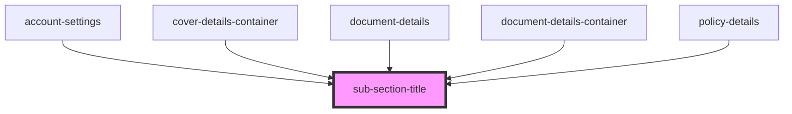

# sub-section-title

<!-- Auto Generated Below -->

## Properties

| Property    | Attribute   | Description | Type     | Default     |
| ----------- | ----------- | ----------- | -------- | ----------- |
| `pagetitle` | `pagetitle` |             | `string` | `undefined` |

## Dependencies

### Used by

 - [account-settings](../../page-layout/account-settings)
 - [cover-details-container](../../page-layout/cover-details-container)
 - [document-details](../../page-layout/document-details)
 - [document-details-container](../../page-layout/document-details-container)
 - [policy-details](../../page-layout/policy-details/policy-details)

### Graph

----------------------------------------------

*ACME documents Inc!*
