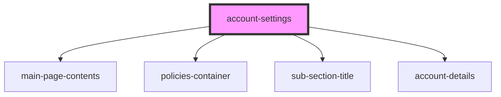

# account-settings

<!-- Auto Generated Below -->

## Properties

| Property | Attribute | Description                                    | Type                            | Default     |
| -------- | --------- | ---------------------------------------------- | ------------------------------- | ----------- |
| `user`   | `user`    | Prop: user: object User Account details object | `UserDataInterface[] \| string` | `undefined` |

## Dependencies

### Depends on

- [main-page-contents](../../app-layout/main-page-contents)
- [policies-container](../policies-container)
- [sub-section-title](../../base-components/sub-section-title)
- [account-details](../account-details)

### Graph

----------------------------------------------

*ACME documents Inc!*
