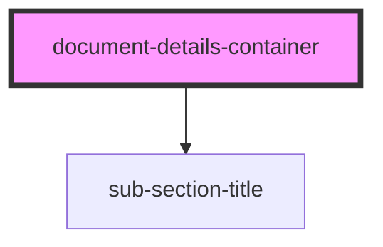

# document-details-container

<!-- Auto Generated Below -->

## Properties

| Property       | Attribute      | Description | Type                              | Default     |
| -------------- | -------------- | ----------- | --------------------------------- | ----------- |
| `coverdetails` | `coverdetails` |             | `PolicyDataInterface[] \| string` | `undefined` |

## Dependencies

### Depends on

- [sub-section-title](../../base-components/sub-section-title)

### Graph

----------------------------------------------

*ACME documents Inc!*
