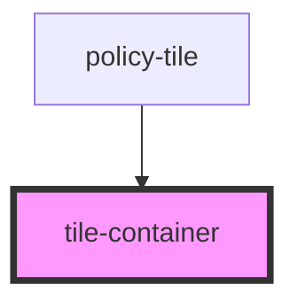

# tile-container

<!-- Auto Generated Below -->

## Properties

| Property | Attribute | Description                                                                         | Type     | Default     |
| -------- | --------- | ----------------------------------------------------------------------------------- | -------- | ----------- |
| `type`   | `type`    | Prop: type: tring Sets the tyle according to the received type (options / products) | `string` | `undefined` |

## Dependencies

### Used by

 - [policy-tile](../../base-components/policy-tile)

### Graph

----------------------------------------------

*ACME documents Inc!*
