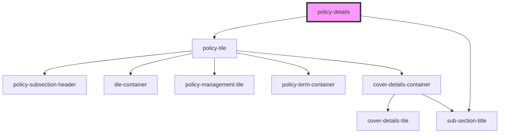

# policy-details

<!-- Auto Generated Below -->

## Properties

| Property   | Attribute  | Description | Type                                 | Default     |
| ---------- | ---------- | ----------- | ------------------------------------ | ----------- |
| `policies` | `policies` |             | `PolicyDetailsInterface[] \| string` | `undefined` |

## Dependencies

### Depends on

- [policy-tile](../../base-components/policy-tile)
- [sub-section-title](../../base-components/sub-section-title)

### Graph

----------------------------------------------

*ACME documents Inc!*
