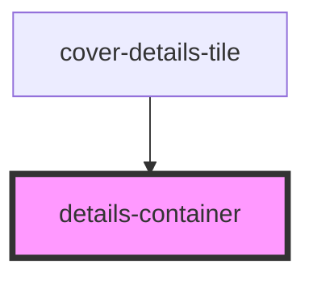

# details-container

<!-- Auto Generated Below -->

## Properties

| Property       | Attribute      | Description                                         | Type                            | Default     |
| -------------- | -------------- | --------------------------------------------------- | ------------------------------- | ----------- |
| `coverdetails` | `coverdetails` | Prop: coverdetails: PolicyDataInterface Policy Data | `PolicyDataInterface \| string` | `undefined` |
| `detailstype`  | `detailstype`  | Prop: detailstype: string Either "car" or "home"    | `string`                        | `undefined` |

## Dependencies

### Used by

 - [cover-details-tile](../cover-details-tile)

### Graph

----------------------------------------------

*ACME documents Inc!*
