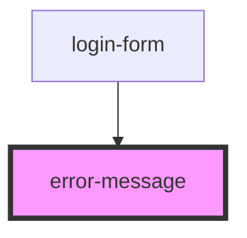

# error-message

<!-- Auto Generated Below -->

## Properties

| Property       | Attribute       | Description                                             | Type     | Default     |
| -------------- | --------------- | ------------------------------------------------------- | -------- | ----------- |
| `errorMessage` | `error-message` | Prop: errorMessage: string The error message to display | `string` | `undefined` |

## Dependencies

### Used by

 - [login-form](../../forms/login-form)

### Graph

----------------------------------------------

*ACME documents Inc!*
