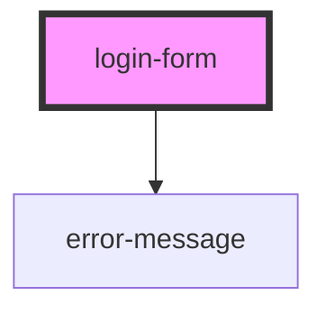

# login-form

<!-- Auto Generated Below -->

## Properties

| Property            | Attribute             | Description                                                                         | Type     | Default     |
| ------------------- | --------------------- | ----------------------------------------------------------------------------------- | -------- | ----------- |
| `forgotPasswordUrl` | `forgot-password-url` | Prop: forgotPasswordUrl: string Page to redirect to if user se;ects forgot password | `string` | `undefined` |

## Events

| Event              | Description                                                           | Type               |
| ------------------ | --------------------------------------------------------------------- | ------------------ |
| `loginShouldOccur` | Event: loginShouldOccur: EventEmitter Event to fire if data validates | `CustomEvent<any>` |

## Dependencies

### Depends on

- [error-message](../../base-components/error-message)

### Graph

----------------------------------------------

*ACME documents Inc!*
