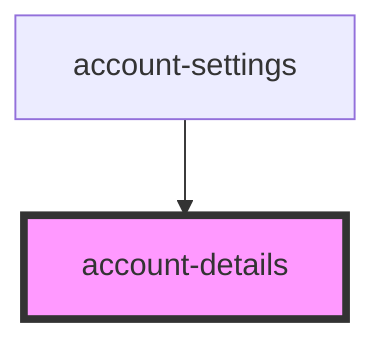

# account-details

<!-- Auto Generated Below -->

## Properties

| Property | Attribute | Description                                    | Type                            | Default     |
| -------- | --------- | ---------------------------------------------- | ------------------------------- | ----------- |
| `user`   | `user`    | Prop: user: object User Account details object | `UserDataInterface[] \| string` | `undefined` |

## Events

| Event             | Description                                                           | Type               |
| ----------------- | --------------------------------------------------------------------- | ------------------ |
| `editUserDetails` | Event: loginShouldOccur: EventEmitter Event to fire if data validates | `CustomEvent<any>` |

## Dependencies

### Used by

 - [account-settings](../account-settings)

### Graph

----------------------------------------------

*ACME documents Inc!*
