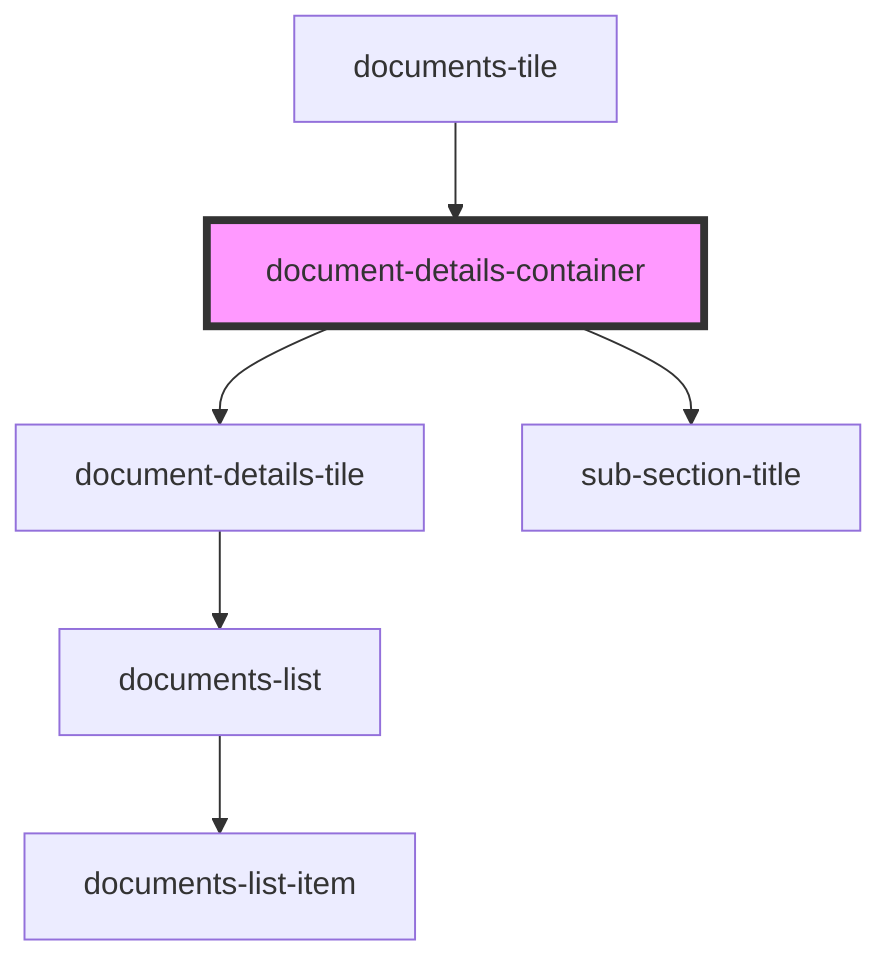

# document-details-container

<!-- Auto Generated Below -->

## Properties

| Property       | Attribute      | Description                                                                 | Type                              | Default     |
| -------------- | -------------- | --------------------------------------------------------------------------- | --------------------------------- | ----------- |
| `coverdetails` | `coverdetails` | Prop: coverdetails: Array<PolicyDataInterface> Array containing Policy Data | `PolicyDataInterface[] \| string` | `undefined` |

## Dependencies

### Used by

 - [documents-tile](../../base-components/documents-tile)

### Depends on

- [document-details-tile](../../base-components/document-details-tile)
- [sub-section-title](../../base-components/sub-section-title)

### Graph

----------------------------------------------

*ACME documents Inc!*
